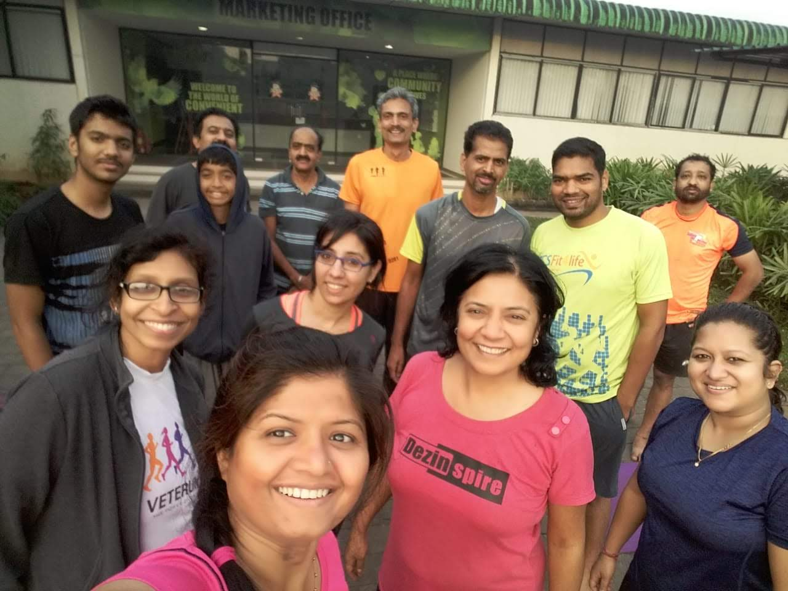

* 

In November 2017, a few members of the PULA Running Group (one of local groups of the Pune Running community), who trained near Pu La Deshpande Garden (hence the name), came up with the idea of starting strength sessions in Nanded City. Along with a few runners from the area, they joined the first strength session in front of the Nanded City marketing office.

The first session was led by Padmaraj Doshi Guruji.

---
