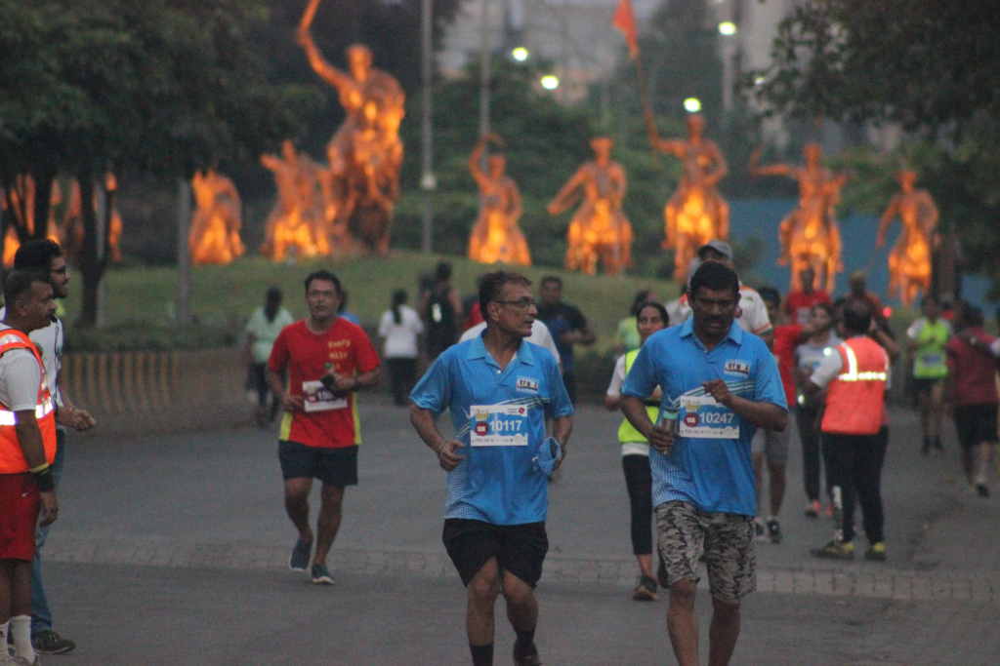
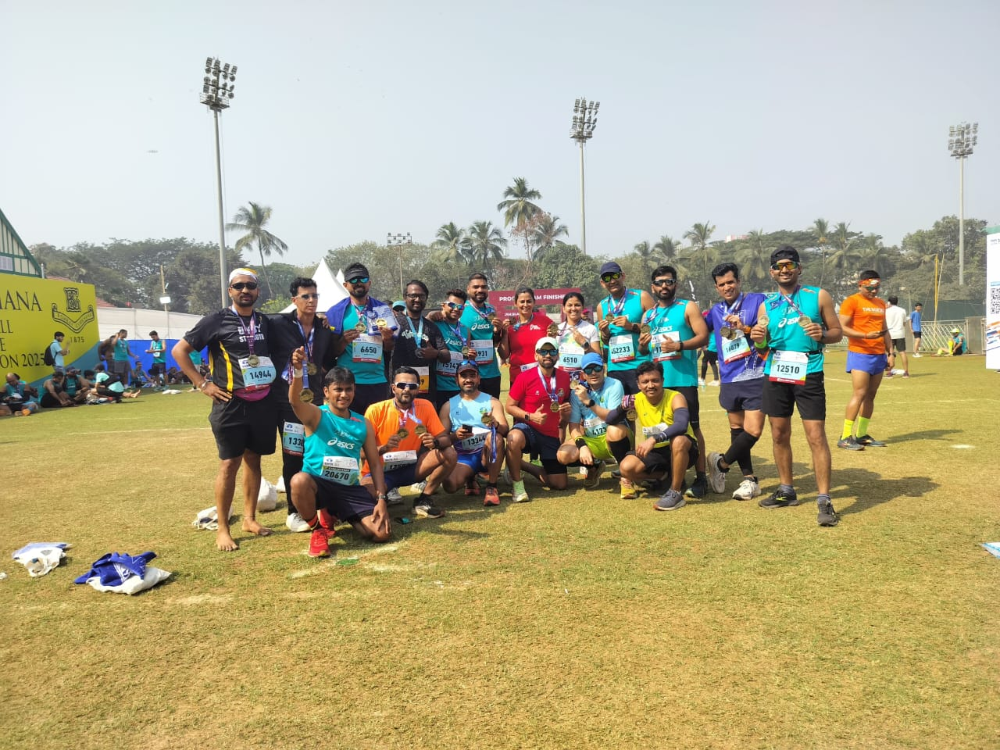

# NCRunners

NCRunners is a dynamic community of over 250+ runners in and around Nanded City, Pune, **established in 2016**.

Dedicated to health and well-being, we offer free weekly sessions in strength training (ST), running, cycling, swimming, trekking, and yoga. Additionally, we provide comprehensive 4-6 month training schedules for members preparing for major marathons, triathlons, and swimathons.

NCRunners is decentralized open community. Open to all.

Our members have achieved remarkable milestones, including:

- Over 100 participants completing marathons across India.
- Many successfully finishing full and half Ironman events/distances.
- Others taking on challenging swimathons & cycling events.

The community is driven by volunteers who organize all activities _at no cost_ emphasizing our commitment to promoting sports and well-being.

## Achievements and Events

We have a strong track record of organizing:

### Organizing Marathons 

| Year | Month | Event | Type | Participants | Description |
| --- | --- | --- | --- | --- | --- |
| 2019 | March | NC LSoM | Community Marathon | 2000+ | The first NC Marathon combinedly organized by PRSouth, NCRunners & VishwaRunners |
| 2022 | December | NC Marathon | Community Marathon | 400+ | Celebrating our 5th anniversary in 2022 |
| 2023 | March | NC LSoM | Community Marathon | 1500+ | The first NC LSoM organized by NCRunners |
| 2024 | March | NC LSoM | Community Marathon | 1800+ | The second NC LSoM organized by NCRunners |
| 2024 | Nov | NC Triathlon | Community Triathlon | 50+ | Community organized NC Triathlon |

### Trek

| Year | Month | Event | Type | Participants | Description |
| --- | --- | --- | --- | --- | --- |
| 2022 | April | K2S | Sahyadri trek | 18 | KATRAJ TO SINHAGAD TREK (Sahyadri trek) |
| 2022 | March | Vasota Satara Trek | Sahyadri Trek | 16 | VASOTA TREK (Sahyadri trek) |
| 2022 | May | Buran Ghati Trek | Himalay trek | 24 | Buran Ghati Trek (Himalay trek) |
| 2023 | July | NC Rajgadh Trek | Sahyadri trek  | 32+ | Trek to Rajgadh |
| 2024 | May | Rupin Pass | Himalayan Trek | 10 | Rupin Pass trek |
| 2024 | Dec | Sandakfu Fulat | Himalay Trek  | 23 | Trek to Sandakfu Fulat  |

### Cycling

| Year | Month | Event | Type | Participants | Description |
| --- | --- | --- | --- | --- | --- |
| 2020 | December | Cycling | Pune to Goa | 17 | Pune to Goa on Cycle |
| 2021 | December | Cycling | Pune to Goa | 11 | Pune to Goa on Cycle |
| 2024 | June | cyclathon | Pandharpur Cycle Wari | 25+ | Covering a 230 km distance from Pune to Pandharpur |

### Swimming

| Year | Month | Event | Type | Participants | Description |
| --- | --- | --- | --- | --- | --- |
| 2024 | Dec | Chivla Beach | Swimathon | 10 | Chivla Beach Open water Swimathon |
| 2023 | Nov | Vasai | Swimathon | 5 | Mumbai swim Open water event |

## Weekly Training Sessions

| Location | Mon | Tue | Wed | Thu | Fri | Sat | Sun |
| --- | --- | --- | --- | --- | --- | --- | --- |
| Madhuvanti | Rest | ST | Run | ST | Run | Yog/Cross | Long Run |
| Sargam | Rest | Yog | Yog | Yog | Yog | Yog | |
| Kalashree | Rest | Run | ST | Run | ST | Yog/Cross | Long Run |
| Mangal Bhairav | Rest | Run | ST | Run | ST | Yog/Cross | Long Run |

The keywords in above table
* Rest - Rest Day
* ST - Strength Training of 1 - 1.5 hrs
* Run - Short Run of 5-7 Km
* Yog - Yog Asanas (Iyengar & S-Vyasa Yog)
* Cross - Cross training like swimming, cycling or treking
* Long Run - Long run of 90 mins+

## Annual Preparation for Key Events

Every year, we collectively train for renowned running events, such as:

1. **Tata Mumbai Marathon**  
   - 30-50 runners participate yearly in Full and Half Marathons.
2. **Satara Hill Marathon**  
   - 30+ runners participate yearly in Half Marathons.
3. **Khadakwasla Ultra Marathon**  
   - 10+ runners participate yearly in 35k, 50k, and 75k distances.
4. **My First 5k/10k/15k at NC LSoM**
   - 20+ new individuals become runners.

## Contact
1. [X/Twitter](https://x.com/NCrunners_in)
2. [Email](ncrunners@proton.me)
3. [Madhuvanti Location](https://maps.app.goo.gl/cjj11w2eAfv5Nt4i8)
