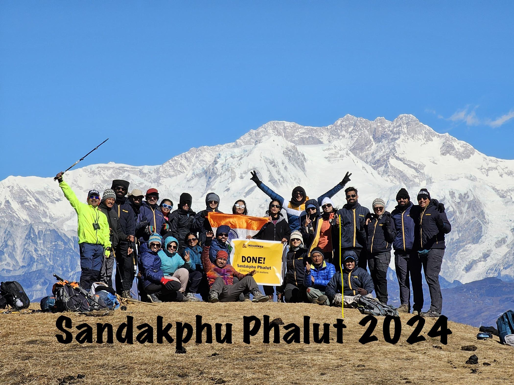
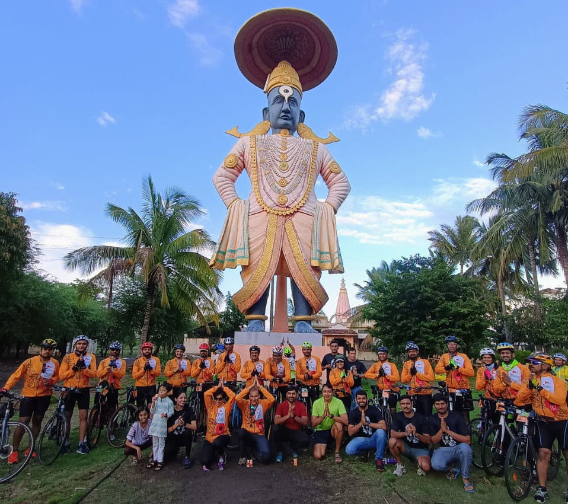
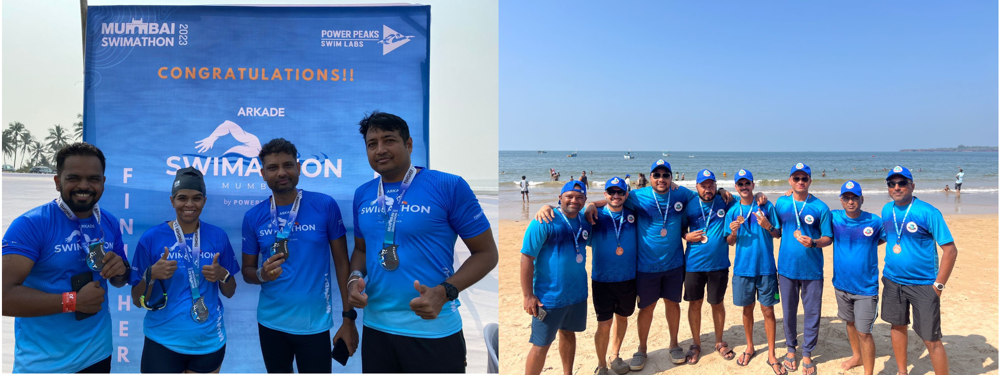
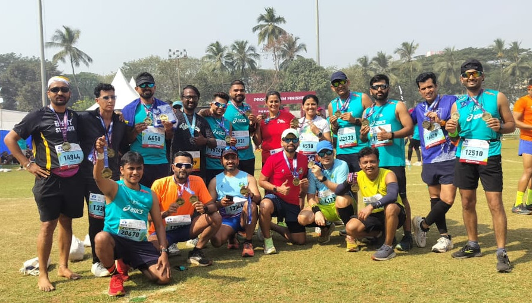

| Home | [Weekly Sessions](#weekly-training-sessions) | [Contact](#contact) | [Achievements](#achievements-and-events) | [Trainings](#annual-preparation-for-key-events) |

```
Every stride we take strengthens not just our body but our will;  
   every mile we conquer builds the endurance of a nation.
      A country that runs together, rises together.
                                                      --- Jai Hind
```

NCRunners is a dynamic community of over 250+ runners in and around Nanded City,
Pune, **established in 2016**.


Dedicated to health and well-being, we offer free weekly sessions in strength
training (ST), running, cycling, swimming, trekking, and yoga. Additionally, we
provide comprehensive 4-6 month training schedules for members preparing for
major marathons, triathlons, and swimathons.

*NCRunners is decentralized open community. Open to all.*

Our members have achieved remarkable milestones, including:

- Over 100 participants completing marathons across India.
- Many successfully finishing full and half Ironman events/distances.
- Others taking on challenging swimathons & cycling events.

The community is driven by volunteers who organize all activities _at no cost_
emphasizing our commitment to promoting sports and well-being.

## NCRunners Challanges

1. [No Sugar Challenge for 21 Days](/noSugar)
2. [100 Days of Activities](/ncrhdc)

## Weekly Training Sessions

| [Home](./) | Weekly Sessions | [Contact](#contact) | [Achievements](#achievements-and-events) | [Trainings](#annual-preparation-for-key-events) |

<a  href="./assets/images/ncrunners_st.jpeg"></a>

| Location | Mon | Tue | Wed | Thu | Fri | Sat | Sun |
| --- | --- | --- | --- | --- | --- | --- | --- |
| Madhuvanti | Rest | ST | Run | ST | Run | Yog/Cross | Long Run |
| Sargam | Rest | Yog | Yog | Yog | Yog | Yog | |
| Kalashree | Rest | Run | ST | Run | ST | Yog/Cross | Long Run |
| Mangal Bhairav | Rest | Run | ST | Run | ST | Yog/Cross | Long Run |

The keywords in above table
* Rest - Rest Day
* ST - Strength Training of 1 - 1.5 hrs
* Run - Short Run of 5-7 Km
* Yog - Yog Asanas (Iyengar & S-Vyasa Yog)
* Cross - Cross training like swimming, cycling or treking
* Long Run - Long run of 90 mins+

Sessions are held at morning 0530 to 0700.

## Contact

| [Home](./) | [Weekly Sessions](#weekly-training-sessions) | Contact | [Achievements](#achievements-and-events) | [Trainings](#annual-preparation-for-key-events) |

1. [X/Twitter](https://x.com/NCrunners_in)
2. [Email](mailto:ncrunners@proton.me)
3. [Madhuvanti Location](https://maps.app.goo.gl/cjj11w2eAfv5Nt4i8)
4. (8+1)5525375(eighteen - 1)

## Achievements and Events

| [Home](./) | [Weekly Sessions](#weekly-training-sessions) | [Contact](#contact) | Achievements | [Trainings](#annual-preparation-for-key-events) |

### Marathons

| [Home](./) | Marathons | [Trek](#trek) | [Cycling](#cycling) | [Swimming](#swimming) |

<a  href="./assets/images/ncrunners_dc.jpg"></a>

| Year | Month | Event | Type | Participants | Description |
| --- | --- | --- | --- | --- | --- |
| 2025 | March | NC LSoM | Community Marathon | 2000+ | [NC-LSoM: Shahid Diwas Theme](https://www.ncrunners.in/NC_LSOM_2025) |
| 2024 | Nov | NC Triathlon | Community Triathlon | 50+ | Community organized NC Triathlon |
| 2024 | March | NC LSoM | Community Marathon | 1800+ | [NC-LSoM: Runner's Safety Theme](https://yogeshpowar.github.io/blog/2024/04/01/NC_LSoM.html) |
| 2023 | March | NC LSoM | Community Marathon | 1500+ | [NC-LSoM: Reduce Reuse Recycle Theme](https://yogeshpowar.github.io/blog/2023/04/03/OrganizingLsom.html) |
| 2022 | December | NC Marathon | Community Marathon | 400+ | Celebrating our 5th anniversary in 2022 |
| 2019 | March | NC LSoM | Community Marathon | 2000+ | The first NC Marathon combinedly organized by PRSouth, NCRunners & VishwaRunners |

### Trek

| [Home](./) | [Marathons](#marathons) | Trek | [Cycling](#cycling) | [Swimming](#swimming) |

<a  href="./assets/images/ncrunners_trek.jpeg"></a>

| Year | Month | Event | Type | Participants | Description |
| --- | --- | --- | --- | --- | --- |
| 2024 | Dec | Sandakphu Phalut | Himalay Trek  | 23 | Trek to Sandakfu Fulat  |
| 2024 | May | Rupin Pass | Himalayan Trek | 10 | Rupin Pass trek |
| 2023 | July | NC Rajgadh Trek | Sahyadri trek  | 32+ | Trek to Rajgadh |
| 2022 | May | Buran Ghati Trek | Himalay trek | 24 | Buran Ghati Trek (Himalay trek) |
| 2022 | April | K2S | Sahyadri trek | 18 | KATRAJ TO SINHAGAD TREK (Sahyadri trek) |
| 2022 | March | Vasota Satara Trek | Sahyadri Trek | 16 | VASOTA TREK (Sahyadri trek) |

### Cycling

| [Home](./) | [Marathons](#marathons) | [Trek](#trek) | Cycling | [Swimming](#swimming) |

<a  href="./assets/images/ncrunners_wari.jpeg"></a>

| Year | Month | Event | Type | Participants | Description |
| --- | --- | --- | --- | --- | --- |
| 2024 | June | cyclathon | Pandharpur Cycle Wari | 25+ | Covering a 230 km distance from Pune to Pandharpur |
| 2021 | December | Cycling | Pune to Goa | 11 | Pune to Goa on Cycle |
| 2020 | December | Cycling | Pune to Goa | 17 | Pune to Goa on Cycle |

### Swimming

| [Home](./) | [Marathons](#marathons) | [Trek](#trek) | [Cycling](#cycling) | Swimming |

<a  href="./assets/images/ncrunners_swim.jpeg"></a>

| Year | Month | Event | Type | Participants | Description |
| --- | --- | --- | --- | --- | --- |
| 2024 | Dec | Chivla Beach | Swimathon | 10 | Chivla Beach Open water Swimathon |
| 2023 | Nov | Vasai | Swimathon | 5 | Mumbai swim Open water event |


## Annual Preparation for Key Events

| [Home](./) | [Weekly Sessions](#weekly-training-sessions) | [Contact](#contact) | [Achievements](#achievements-and-events) | Trainings |


<a  href="./assets/images/ncrunners_tmm25.jpeg"></a>

Every year, we collectively train for renowned running events, such as:

1. **Tata Mumbai Marathon**
   - 30-50 runners participate yearly in Full and Half Marathons.
2. **Satara Hill Marathon**
   - 30+ runners participate yearly in Half Marathons.
3. **Khadakwasla Ultra Marathon**
   - 10+ runners participate yearly in 35k, 50k, and 75k distances.
4. **My First 5k/10k/15k at NC LSoM**
   - 20+ new individuals become runners every year.

---
[CC BY-SA 4.0](https://creativecommons.org/licenses/by-sa/4.0/)

Except where otherwise noted, contents are licensed under a Creative Commons
Attribution 4.0 International license


Last Updated on 24th Jan 2025
---
Developed by [doublefree.in](https://doublefree.in)
